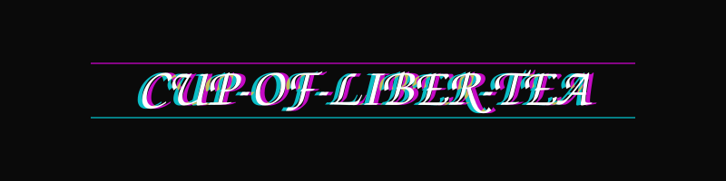

  

 

  <h3>🖥️ JARVIS System Status</h3>
  <!-- Relative path to SVG in repo -->
  

  

  

  

  <h3>⏰ 06:28 (KST) - 🌅 Good Morning! 커피부터 마시자.</h3>

 

<h3>🌍 Service Status</h3>

 Last Check: 2026-07-12 21:28 (UTC)
 

  <h3>🐍 Contribution Snake (Eating my commits)</h3>
  <!-- 
    Snake 애니메이션은 GitHub Actions에 의해 생성됩니다.
    처음 적용 시 이미지가 안 보일 수 있으며, Actions가 한 번 실행된 후 나타납니다.
  -->
  <picture>
    <source media="(prefers-color-scheme: dark)" srcset="https://github.com/Cup-Of-Liber-Tea/Cup-Of-Liber-Tea/blob/output/github-contribution-grid-snake-dark.svg?raw=true">
    <source media="(prefers-color-scheme: light)" srcset="https://github.com/Cup-Of-Liber-Tea/Cup-Of-Liber-Tea/blob/output/github-contribution-grid-snake.svg?raw=true">
    
  </picture>

  

  <h3>♟️ Daily Chess Puzzle (White to Move)</h3>
  
   
  Click image to solve!

  

  <h3>🤣 Random Dev Meme</h3>
  <!-- 소스 교체: 더 안정적인 git.io/meme-api 사용 -->
  

  

  <h3>⛅ Weather & Vibe</h3>
  

 

  <h3>💣 Minesweeper (Don't blow up)</h3>
  <table>
    <tr>
      <td>

⬜
1️⃣
</td>
      <td>

⬜
1️⃣
</td>
      <td>

⬜
2️⃣
</td>
      <td>

⬜
💣
</td>
    </tr>
    <tr>
      <td>

⬜
1️⃣
</td>
      <td>

⬜
💣
</td>
      <td>

⬜
2️⃣
</td>
      <td>

⬜
1️⃣
</td>
    </tr>
    <tr>
      <td>

⬜
1️⃣
</td>
      <td>

⬜
1️⃣
</td>
      <td>

⬜
1️⃣
</td>
      <td>

⬜
1️⃣
</td>
    </tr>
    <tr>
      <td>

⬜
⬜
</td>
      <td>

⬜
⬜
</td>
      <td>

⬜
⬜
</td>
      <td>

⬜
⬜
</td>
    </tr>
  </table>

  

  <h3>📈 3D Contribution Activity</h3>
  

  

  <h3>🏢 Organization Info</h3>
   
  
  <!-- Followers Badge -->
  
  

  

  <h3>🗳️ Community & Guestbook</h3>
  <!-- Visitor Count -->
  
    
  <!-- Guestbook Link -->
  

  

